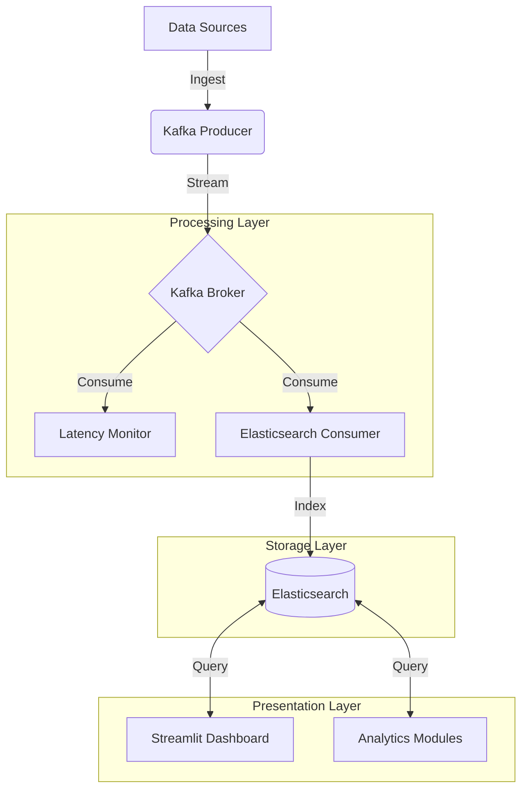

# Real-Time Narrative Intelligence Engine: A Research Framework

## Abstract

The **Real-Time Narrative Intelligence Engine** is a high-throughput, latency-optimized platform designed to analyze, cluster, and visualize news narratives in real-time. By integrating a microservices architecture (Kafka, Elasticsearch) with advanced Natural Language Processing (Sentence Transformers, UMAP, K-Means), the system provides a scalable solution for detecting emerging stories, quantifying sentiment volatility, and identifying sensationalist "clickbait" content using a novel Hype vs. Substance scoring algorithm. This document serves as a comprehensive guide for researchers and developers to reproduce the system, run performance benchmarks, and utilize the analytical framework for academic publication.

---

## 1. Introduction

In the era of information overload, the ability to discern factual reporting from sensationalism and to track the evolution of narratives in real-time is critical. This project addresses these challenges by proposing a system that:
1.  **Semantic Clustering**: Groups disparate articles into cohesive narrative threads using semantic embeddings.
2.  **Sensationalism Detection**: Quantifies the "clickbait" nature of articles through a hybrid linguistic-structural heuristic.
3.  **Real-Time Performance**: Evaluates system throughput and latency under varying load conditions, providing empirical data for stream processing efficiency.

---

## 2. System Architecture

The system follows a three-tier architecture designed for decoupling, scalability, and observability.

### 2.1 High-Level Architecture


### 2.2 Component Breakdown

| Component | Technology | Role |
|-----------|------------|------|
| **Message Broker** | Apache Kafka | Decouples ingestion from processing; handles backpressure. |
| **Storage & Search** | Elasticsearch | Stores articles with vectors; enables text search and aggregation. |
| **NLP Engine** | `sentence-transformers` | Generates 384-dimensional semantic embeddings (all-MiniLM-L6-v2). |
| **Clustering** | UMAP + K-Means | Reduces dimensionality (384D $\to$ 2D) and groups narratives. |
| **Visualization** | Streamlit | Interactive frontend for real-time monitoring and analysis. |

---

## 3. Methodology

### 3.1 Data Ingestion & Synthetic Generation
To validate the system without external dependencies, we employ a **Synthetic Data Generator** (`src/ingestion/synthetic_to_es.py`).
- **Volume**: 1,000 documents (920 Regular, 80 Clickbait).
- **Clusters**: 12 thematic clusters (e.g., "Digital Transformation", "Pharma", "Space Tech") + 1 Clickbait cluster.
- **Enrichment**: Each article is tagged with:
    - `sentiment_score`: $(-1.0, 1.0)$
    - `entities`: Spacy NER (`PERSON`, `ORG`, `GPE`, `LOC`)
    - `timestamp`: Staggered for time-series analysis

### 3.2 Clustering Pipeline (Mathematically Defined)
The clustering engine uses a two-step process to identify narratives:
1.  **Embedding Generation**:
    $$ v_i = \text{Transformer}(d_i) \in \mathbb{R}^{384} $$
    Where $v_i$ is the vector representation of document $d_i$.

2.  **Dimensionality Reduction (UMAP)**:
    Projects $v_i$ to a lower-dimensional manifold $u_i \in \mathbb{R}^2$ preserving local neighborhood structure.
    $$ \text{Optimize } \sum_{j} w_{ij} \log \left( \frac{w_{ij}}{q_{ij}} \right) $$

3.  **K-Means Clustering**:
    Partitions the embedded space into $K$ clusters by minimizing within-cluster sum of squares (WCSS):
    $$ \arg\min_S \sum_{i=1}^{K} \sum_{x \in S_i} ||x - \mu_i||^2 $$

### 3.3 Algorithms

#### A. Clickbait Detection (Hype Scoring)
We introduce a heuristic `Hype Score` ($H$) to quantify sensationalism:
$$ H = \max(0, \min(10, S - \frac{D}{2})) $$
Where:
- $S$ is the **Sensationalism Score** (0-5), derived from linguistic markers (all-caps, "shocking", "revealed", punctuation).
- $D$ is the **Factual Density** (entities per 100 words), enabling the distinction between "exciting news" and "empty hype".

#### B. Latency Measurement
For performance benchmarking:
$$ L = T_{ES} - T_{Kafka} $$
Where:
- $T_{Kafka}$ is the producer timestamp (entry to pipeline).
- $T_{ES}$ is the indexing timestamp (persistence).

#### C. Peak Velocity Detection
To detect "breaking news":
$$ V_p = \max\left(\frac{\Delta N}{\Delta t}\right) $$
- $\Delta N$: New documents in time window $\Delta t$.
- Trigger Condition: $V_p > \text{Threshold}$ (e.g., 50 docs/min).

---

## 4. Experimental Evaluation

The project includes a **Performance Monitoring Suite** (`stream_monitoring/`) to generate publication-ready metrics.

### 4.1 Benchmark Configurations
We test the system under three load conditions:
1.  **Low Load**: 100 articles/min
2.  **Medium Load**: 1,000 articles/min
3.  **Stress Test**: 10,000 articles/min

### 4.2 Expected Results
Running the suite yields:
- **Latency vs. Throughput**: A dual-axis chart showing how latency scales with throughput (demonstrating system stability).
- **Peak Velocity**: A temporal area chart illustrating the system's reaction time ($D_{lag}$) to a burst of new information.

---

## 5. Installation & Usage

### 5.1 Prerequisites
- **OS**: Windows, macOS, or Linux
- **Software**: Python 3.8+, Elasticsearch 7.x+, (Optional) Kafka

### 5.2 Quick Setup
1.  **Clone the Repository**:
    ```bash
    git clone <repo_url>
    cd Narrative-Engine
    ```
2.  **Environment Setup**:
    ```powershell
    python -m venv .venv
    .\.venv\Scripts\Activate.ps1
    pip install -r requirements.txt
    python -m spacy download en_core_web_sm
    ```
3.  **Start Services**:
    - Ensure Elasticsearch is running at `localhost:9200`.

### 5.3 Running the Application
To launch the full dashboard:
```powershell
streamlit run dashboard_enhanced.py
```

### 5.4 Reproducing Research Data
To generate the operational datasets and performance graphs:
```powershell
# 1. Generate Synthetic Data
python src/ingestion/synthetic_to_es.py

# 2. Run Performance Suite (Full Benchmark)
cd stream_monitoring
python run_monitoring_suite.py
```
*Outputs will be saved to `stream_monitoring/results/`.*

---

## 6. Project Structure

```
.
├── batch_analytics/          # Scripts for offline data processing
├── stream_monitoring/        # Performance evaluation suite (Research Logic)
│   ├── run_monitoring_suite.py  # Main benchmark script
│   ├── latency_monitor.py       # L = T_es - T_kafka
│   └── processing/              # Visualization generators
├── src/                      # Core Source Code
│   ├── ingestion/            # Data generators & consumers
│   └── processing/           # NLP & ML pipelines
├── dashboard_enhanced.py     # Streamlit User Interface
└── RESEARCH_README.md        # This file
```

---

## 7. Future Work
- **Federated Learning**: Incorporating privacy-preserving model updates.
- **Multimodal Analysis**: Integrating image and video metadata into the narrative clusters.
- **Graph Neural Networks**: Enhancing entity resolution using GNNs on the knowledge graph.
